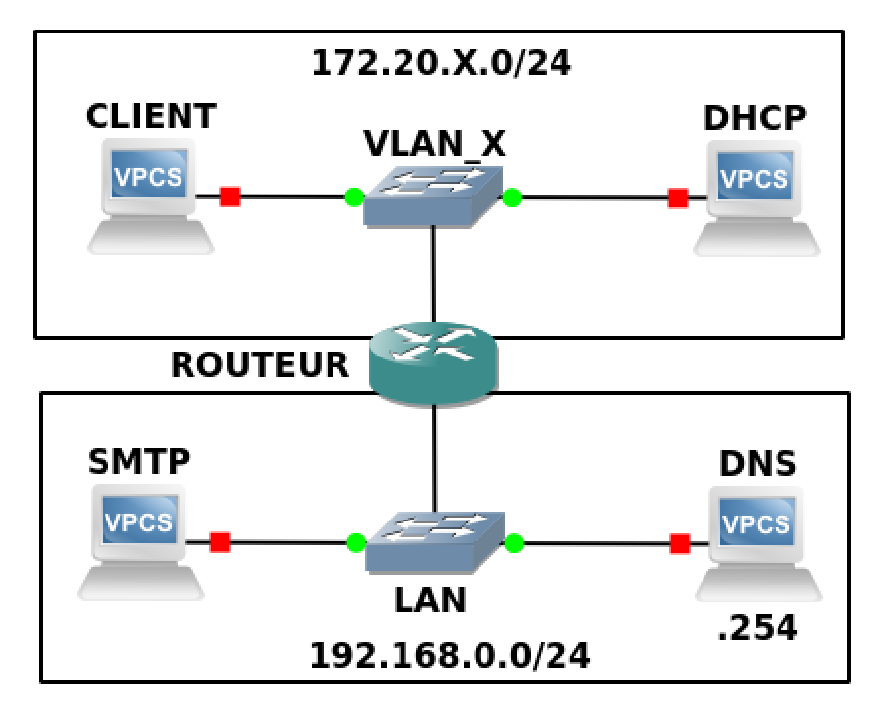

# Configuration réseau

* NOMS : Bernier Justine, Pasquet Clément
* GROUPE de TP : 1-2
* X : 181
* SECRET : arcturusepsilonscorpii
* IP_CLIENT : 172.20.181.1
* IP_DHCP : 172.20.181.2
* IP_SMTP : 192.168.0.81
* IPs du ROUTEUR : 172.20.181.3 / 192.168.0.81

**Note**: Le document suivant doit rendre compte de votre plan d’adressage (i.e. la description des différents LAN, de leur interconnexion, des machines avec les IP voire @MAC que vous jugerez pertinentes), de vos tables de routage de CLIENT, ROUTEUR, SMTP et celle (supposée) de DNS, des commandes à réaliser sur CLIENT, ROUTEUR, SMTP, et tout ce qui vous semble nécessaire à la configuration de votre réseau.

## But de la Partie 1


Il faut réaliser la configuration statique ci-dessus, autrement dit, mettre un vlan et un lan ensemble via un pc appelé "routeur".
De plus, le DNS devra fournir l'adresse IP de "SMTP".

## Plan d'adressage
Client
172.20.181.1/24

DHCP
172.20.181.2/24

VLAN_181
172.20.181.0/24

172.20.181.3/24
Routeur
192.168.0.181

LAN
192.168.0.0/24

DNS
192.168.0.254

SMTP
192.168.0.81


## Tables de routage

**Note**: il existe des générateurs de tables MD https://www.tablesgenerator.com/markdown_tables

### **Client**
| **destination** | **iface** | **gw**       |
|-----------------|-----------|--------------|
| 172.20.181.0    | jaune.181 | 172.20.181.1 |
| 192.168.0.0     | jaune.181 | 172.20.181.3 |

## **Routeur**
| **destination** | **iface** | **gw**        |
|-----------------|-----------|---------------|
| 172.20.181.0    | jaune.181 | 172.20.181.1  |
| 192.168.0.0     | jaune.181 | 192.168.0.181 |

## **Smtp**
| **destination** | **iface** | **gw**        |
|-----------------|-----------|---------------|
| 172.20.181.0    | jaune.181 | 192.168.0.181 |
| 192.168.0.0     | jaune.181 | 192.168.0.81  |

## **Dhcp**
| **destination** | **iface** | **gw**       |
|-----------------|-----------|--------------|
| 172.20.181.0    | jaune.181 | 172.20.181.2 |
| 192.168.0.0     | jaune.181 | 172.20.181.3 |
## Commandes de configuration

Commande pour connaître sa configuration réseau :

```javascript
ip a 
```

La première chose à faire, est de rêglé le fichier qui gère les interfaces pour éviter que les adresses IP "sautent" :

Il faut faire la commande suivante :

```sudo nano /etc/network/interfaces```

Et dans la page qui s'affichera, il faudra modifier les interfaces généralements nommés enosp1 et enosp2 par *Bleue et Jaune* comme dans l'exemple ci dessous :
```
auto lo
iface lo inet loopback

allow-hotplug eno1
iface eno1 inet manual
ip
allow-hotplug bleue
iface bleue inet manual

allow-hotplug jaune
iface jaune inet manual
```

Également, pour que le changement soit effective, il faut rédémarrer les systèmes en causes pour résoudre le problème :
```bash
systemctl restart networking
systemctl restart network-manager
```


## Étape 1 : Le Vlan

Pour pouvoir mettre en place le VLAN entre CLIENT, DHCP et ROUTEUR, il faut déjà vérifier que les interfaces en questions soit bien utilisables avec :
```bash
sudo ip link set jaune up
```
**Pour chaque PC**, cela permet de "mettre UP", c'est à dire d'activer, les interfaces jaune des différents PC.

<br></br>

Aussi, il est nécessaire dans le lancer **8021q**, un module du noyau Linux qui prend en charge les VLAN. 
Pour faire cela, nous utilisons la commande suivante :
```bash
modprobe 8021q
```

## Créer le Vlan :
Pour créer un Vlan, qui pourrait être grossièrement définie comme un sous réseau, il faut créer un *Vlan sur l'interface Jaune* .
Pour ce faire, il faut faire la commande suivante ( uniq. sur Linux ) :
```bash
ip link add link jaune name jaune.181 type vlan id 181
```
Ps : il faut la faire pour tous les pc sur le vlan
**Ici**, le nom de ce Vlan sera `jaune.181`, et son id sera `181`, un chiffre spécial à notre groupe.

Il faut ensuite "activer" ces VLAN avec la commande suivante :
```bash
ip link set jaune.181 up
```
Pour vérifier sa connexion, nous pouvons "ping-er" une adresse IP sur ce VLAN, comme ici ou nous pinguons routeur :

`ping 172.20.181.3`

Ensuite, nous devons créer les ip's pour chaque machines dans le réseau :

<details>
<summary>IP du CLIENT ( cliquez pour dérouler )</summary>

ip a add 172.20.181.1/24 dev jaune.181

</details>
<details>
<summary>IP de DHCP ( cliquez pour dérouler )</summary>

ip a add 172.20.181.2/24 dev jaune.181 

</details>
<details>
<summary>IP de ROUTEUR ( cliquez pour dérouler )</summary>

ip a add 172.20.181.3/24 dev jaune.181

</details>

<br></br>

## Création du Lan

Aussi, le routeur possédant 2 ip, l'une dans le Vlan et l'autre dans le future lan, nous devons lui attribuer une ip pour le lan :

```bash
ip a add 192.168.0.181/24 dev jaune
```

Une fois que nous avons crées les 2 ip de ROUTEUR, il faut attribuer une adresse IP à SMTP, en effet, il est écrit qu'il faut que son adresse ip ( celle de SMTP ) soit donné grâce au DNS.

Pour faire cela, nous allons interroger le DNS.

Pour rappel, le rôle d'un DNS est de "relier" les liens internet ( google.com, smtp181.mail181.com ... ) et les adresses ip des serveurs d'Internet.

```bash
nslookup smtp181.mail181.com 192.168.0.254
```
> Nom : smtp181.mail181.com

> Adresse : 192.168.0.81

Ici, "smtp181.mail181.com" est le lien duquel on cherche l'adresse IP et "192.168.0.254" est l'adresse IP du DNS.

Une fois que le DNS nous a donné une adresse IP, il faut attribuer cette adresse IP à notre SMTP.

Pour faire cela il faut tout naturellement lui rajouter cette adresse ip avec la commande suivante : 
```bash
ip a addr 192.168.0.81/24 dev jaune
```

Cependant, pour que les PC du VLAN puissent accéder aux PC du LAN, il faut configurer le "forwarding" sur le routeur.

Pour faire cela, il faut éditer le fichier `/etc/sysctl.conf` et **décommenter** la ligne suivante :

> `net.ipv4.ip_forward=1`

Ensuite, il faut redémarrer le service réseau pour que le changement soit effectué :
```bash
sysctl -p
```

### Mise en place des routes
Pour que chaque pc puisse en "pinger" un autre, il faut rajouter des routes à chaque PC :
*   Route pour les PC du VLAN :
*   * `ip r add 192.168.0.0/24 via 172.20.181.3`

*   Route pour SMTP :
*   *  `ip r add 172.20.181.0/24 via 192.168.0.181`

Nous avons testés avec un ping 172.20.181.2 côté smtp
et ping 192.168.0.81 côté client
et cela marche !

### Étape Finale : Les Logs
Maintenant, il faut créer ce qu'on appelle des "log".

Pour faire cela, nous avons téléchargé le fichier "log" amablement donné par nos professeurs. 

Premièrement, il faut se donner **les droits d'exécution** pour le fichier en question.

Voici la commande :
```bash
chmod 777 ./log
```

Puis finalement, il faut créer ce 'log' grâce à ce fichier, et mettre ce qu'il affiche dans un fichier "SMTP.log" dans le cas de SMTP :
```bash
./log > SMTP.log
```

plan d'addressage
Client 


