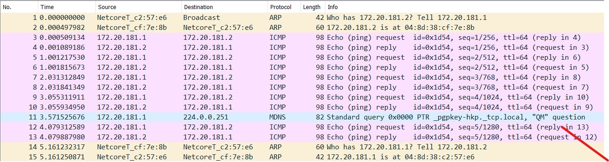

# Configuration réseau

* NOMS : Bernier Justine, Pasquet Clément
* GROUPE de TP : 1-2
* X : 181
* SECRET : arcturusepsilonscorpii
* IP_CLIENT : 172.20.181.1
* IP_DHCP : 172.20.181.2
* IP_SMTP : 192.168.0.81
* IPs du ROUTEUR : 172.20.181.3 / 192.168.0.81

**Note**: Le document suivant doit rendre compte de votre plan d’adressage (i.e. la description des différents LAN, de leur interconnexion, des machines avec les IP voire @MAC que vous jugerez pertinentes), de vos tables de routage de CLIENT, ROUTEUR, SMTP et celle (supposée) de DNS, des commandes à réaliser sur CLIENT, ROUTEUR, SMTP, et tout ce qui vous semble nécessaire à la configuration de votre réseau.

## But de la Partie 1


Il faut réaliser la configuration statique ci-dessus, autrement dit, mettre un vlan et un lan ensemble via un pc appelé "routeur".
De plus, le DNS devra fournir l'adresse IP de "SMTP".

## Plan d'adressage

Routeur
ces addresses ip sur les deux réseaux
172.20.181.3/24 et sur le réseau de la vlan
192.168.0.181 sur le réseau LAN
- Le routeur est configuré avec l'adresse IP 192.168.0.181 sur le réseau LAN et connecté au réseau VLAN_181 avec cette adresse 172.20.181.3/24.

Client
172.20.181.1/24 sur le réseau de vlan_181
- Le client est configuré avec l'adresse IP 172.20.181.1/24, connecté au réseau VLAN_181(jaune.181).

DHCP
172.20.181.2/24 sur le réseau de vlan_181
- Le serveur DHCP est configuré avec l'adresse IP 172.20.181.2/24, connecté au réseau VLAN_181.

VLAN_181
172.20.181.0/24 sur le réseau de vlan_181
- Le VLAN_181 est configuré avec le réseau 172.20.181.0/24.

LAN
192.168.0.0/24 > sur le réseau de la lan
- Le réseau LAN est défini comme 192.168.0.0/24.

DNS
192.168.0.254 > connecté a la lan
- Le serveur DNS est configuré avec l'adresse IP 192.168.0.254, connecté au réseau LAN.

SMTP
192.168.0.81 > connecté a la lan
- Le serveur SMTP est configuré avec l'adresse IP 192.168.0.81 sur le réseau LAN.

### Voici un schéma du plan d'adressage :


## Tables de routage

**Note**: il existe des générateurs de tables MD https://www.tablesgenerator.com/markdown_tables

### **Client**
| **destination** | **iface** | **gw**       |
|-----------------|-----------|--------------|
| 172.20.181.0/24 | jaune.181 | ------------ |
| 192.168.0.0/24  | jaune.181 | 172.20.181.3 |

### **Routeur**
| **destination** | **iface** | **gw**        |
|-----------------|-----------|---------------|
| 172.20.181.0/24    | jaune.181 | ------------  |
| 192.168.0.0/24     | jaune | ------------- |

### **Smtp**
| **destination** | **iface** | **gw**        |
|-----------------|:---------:|---------------|
| 172.20.181.0/24 | jaune     | 192.168.0.181 |
| 192.168.0.0/24  | jaune     | ------------- |

### **DNS**
| **destination** | **iface** | **gw**       |
|-----------------|-----------|--------------|
| 192.168.0.0/24  | jaune     |------------- |


## Commandes de configuration

Commande pour connaître sa configuration réseau :

```javascript
ip a 
```

La première chose à faire, est de rêglé le fichier qui gère les interfaces pour éviter que les adresses IP "sautent" :

Il faut faire la commande suivante :

```sudo nano /etc/network/interfaces```

Et dans la page qui s'affichera, il faudra modifier les interfaces généralements nommés enosp1 et enosp2 par *Bleue et Jaune* comme dans l'exemple ci dessous :
```
auto lo
iface lo inet loopback

allow-hotplug eno1
iface eno1 inet manual
ip
allow-hotplug bleue
iface bleue inet manual

allow-hotplug jaune
iface jaune inet manual
```

Également, pour que le changement soit effective, il faut rédémarrer les systèmes en causes pour résoudre le problème :
```bash
systemctl restart networking
systemctl restart network-manager
```


## Étape 1 : Le Vlan

Pour pouvoir mettre en place le VLAN entre CLIENT, DHCP et ROUTEUR, il faut déjà vérifier que les interfaces en questions soit bien utilisables avec :
```bash
sudo ip link set jaune up
```
**Pour chaque PC**, cela permet de "mettre UP", c'est à dire d'activer, les interfaces jaune des différents PC.

<br></br>

Aussi, il est nécessaire dans le lancer **8021q**, un module du noyau Linux qui prend en charge les VLAN. 
Pour faire cela, nous utilisons la commande suivante :
```bash
modprobe 8021q
```

## Créer le Vlan :
Pour créer un Vlan, qui pourrait être grossièrement définie comme un sous réseau, il faut créer un *Vlan sur l'interface Jaune* .
Pour ce faire, il faut faire la commande suivante ( uniq. sur Linux ) :
```bash
ip link add link jaune name jaune.181 type vlan id VLAN_181
```
Ps : il faut la faire pour tous les pc sur le vlan
**Ici**, le nom de ce Vlan sera `jaune.181`, et son id sera `VLAN_181`, un chiffre spécial à notre groupe.

Il faut ensuite "activer" ce VLAN avec la commande suivante :
```bash
ip link set jaune.181 up
```
Pour vérifier sa connexion, nous pouvons "ping-er" une adresse IP sur ce VLAN, comme ici ou nous pinguons routeur :

`ping 172.20.181.3`

Ensuite, nous devons créer les ip's pour chaque machines dans le réseau :

<details>
<summary>IP du CLIENT ( cliquez pour dérouler )</summary>

ip a add 172.20.181.1/24 dev jaune.181

</details>
<details>
<summary>IP de DHCP ( cliquez pour dérouler )</summary>

ip a add 172.20.181.2/24 dev jaune.181 

</details>
<details>
<summary>IP de ROUTEUR ( cliquez pour dérouler )</summary>

ip a add 172.20.181.3/24 dev jaune.181

</details>

<br></br>

## Création du Lan

Aussi, le routeur possédant 2 ip, l'une dans le Vlan et l'autre dans le future lan, nous devons lui attribuer une ip pour le lan :

```bash
ip a add 192.168.0.181/24 dev jaune
```

Une fois que nous avons crées les 2 ip de ROUTEUR, il faut attribuer une adresse IP à SMTP, en effet, il est écrit qu'il faut que son adresse ip ( celle de SMTP ) soit donné grâce au DNS.

Pour faire cela, nous allons interroger le DNS.

Pour rappel, le rôle d'un DNS est de "relier" les liens internet ( google.com, smtp181.mail181.com ... ) et les adresses ip des serveurs d'Internet.

```bash
nslookup smtp181.mail181.com 192.168.0.254
```
> Nom : smtp181.mail181.com

> Adresse : 192.168.0.81

Ici, "smtp181.mail181.com" est le lien duquel on cherche l'adresse IP et "192.168.0.254" est l'adresse IP du DNS.

Une fois que le DNS nous a donné une adresse IP, il faut attribuer cette adresse IP à notre SMTP.

Pour faire cela il faut tout naturellement lui rajouter cette adresse ip avec la commande suivante : 
```bash
ip a addr 192.168.0.81/24 dev jaune
```

Cependant, pour que les PC du VLAN puissent accéder aux PC du LAN, il faut configurer le "forwarding" sur le routeur.

Pour faire cela, il faut éditer le fichier `/etc/sysctl.conf` et **décommenter** la ligne suivante :

> `net.ipv4.ip_forward=1`

Ensuite, il faut redémarrer le service réseau pour que le changement soit effectué :
```bash
sysctl -p
```

### Mise en place des routes
Pour que chaque pc puisse en "pinger" un autre, il faut rajouter des routes à chaque PC :
*   Route pour les PC du VLAN :
*   * `ip r add 192.168.0.0/24 via 172.20.181.3`

*   Route pour SMTP :
*   *  `ip r add 172.20.181.0/24 via 192.168.0.181`

Nous avons testés avec un ping 172.20.181.2 côté smtp
et ping 192.168.0.81 côté client
et cela marche !

### Étape Finale : Les Logs
Maintenant, il faut créer ce qu'on appelle des "log".

Pour faire cela, nous avons téléchargé le fichier "log" amablement donné par nos professeurs. 

Premièrement, il faut se donner **les droits d'exécution** pour le fichier en question.

Voici la commande :
```bash
chmod 777 ./log
```

Puis finalement, il faut créer ce 'log' grâce à ce fichier, et mettre ce qu'il affiche dans un fichier "SMTP.log" dans le cas de SMTP :
```bash
./log > SMTP.log
```

## Analyse capture de trames - VLAN


Ici nous allons analyser le flux entre deux machines du même VLAN, CLIENT et DHCP.

En premier, le client cherche l'adresse MAC du DHCP grâce au protocole `ARP`.

Le DHCP répond lui même à la requête en donnant sa propre adresse MAC.

Ensuite nous pouvons voir un échange de requête ICMP, un protocole de diagnostic réseau.

A la fin de chaque trame, nous pouvons voir que le temps total nécessaire pour répondre à une requête est supérieur au temps total nécessaire pour juste envoyer une requête.

C'est assez normal, puisque le temps est calculé en additionnant les temsp précédants.

La requête `MDNS` est utilisé pour la résolution local de nom de domaine sans DNS propre. Cependant, la raison de sa présence ici n'est pas claire.

A la fin, DHCP fait une requête ARP à CLIENT.

C'est peut être pour pouvoir mettre à jour sa table de cache ARP, et ainsi vérifier que 172.20.181.2 a bien l'adresse Mac qu'il avait enregistré.

## Analyse capture de trames - DNS


Ici, nous devons observer le flux de client qui "demandera" une addresse ip pour son domaine "smtp181.mail181.com", et qui devra donc passer par le routeur pour demander au DNS.

Nous avons 2 questions et 2 réponses.

Le client sachant directement l'adresse du DNS, il n'a pas besoin de faire une requête ARP pour la savoir.

Premièrement, il va demander quelle adresse IP pour `smtp181.mail181.com`.

Le DNS lui répondrera un autre nom de domaine : `machine181.mail181.com`.

Le client lui demandera donc qu'elle est l'adresse IP associé à ce nom de domaine : ce sera `192.168.0.81`.

A noter que dès la première requête, le serveur DNS donne aussi l'adresse IP correspondante, il est donc possible que CLIENT utilise l'adresse IP donné par la première requête.

Nous pouvons aussi remarquer que le DNS redonne au CLIENT l'adresse IP du DNS a utiliser. Ici c'est lui-même mais dans d'autres cas ca aurait pu être quelqu'un d'autre.

## Analyse capture de trames - routage


Ici, nous partons sur des requêtes similaires à la capture de trame du Vlan.

Cela commence directement par une requête ICMP depuis CLIENT vers SMTP.

Il y a 5 requêtes, à chaque fois avec leur réponse, donc il y a **10 lignes**.

Ensuite, une fois que les 5 ping sont finies, les 2 pc remettent supposemment à jour leur table de cache ARP, comme pour "vérifier" que leur table de routage est bien à jour.

Puis, ca recommence mais dans l'autre sens, cette fois ci SMTP va pinger *5 fois* CLIENT.


