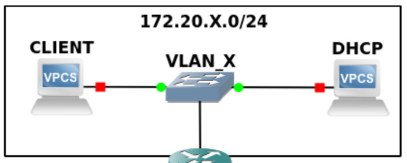

# Configuration réseau

* NOMS : Bernier Justine, Pasquet Clément
* GROUPE de TP : 1-2
* X : 181
* SECRET : arcturusepsilonscorpii
* IP_CLIENT : 172.20.181.1
* IP_DHCP : 172.20.181.2
* IP_SMTP : 192.168.0.81
* IPs du ROUTEUR : 172.20.181.3 / 192.168.0.181


**Note**: Ce document d’une à deux pages, doit décrire au choix : 
* soit comment comment installer un VLAN 
* soit comment configurer un serveur DHCP. 
Une personne ne sachant pas configurer un de ces services doit être capable de le faire en suivant le manuel (description globales des étapes et détails sur les différentes machines, commandes à exécuter, codes à modifier, commandes de test à réaliser, résultats à observer, etc.). Votre manuel doit être complet e.g. si votre service requiert une configuration réseau alors votre manuel doit aussi l'expliquer. Indiquer explicitement les adresses IP et éventuellement les adresses MAC des machines que vous utilisez si c’est pertinent.

## But de la partie : Serveur DHCP

Le but est de parametrer un serveur DHCP.

Pour rappel, le but d'un serveur DHCP est de **donner une configuration réseau** à un pc qui n'en a pas.

Ici, nous allons créer notre serveur DHCP avec les mêmes paramètres que pour la partie 1.

C'est pour cela que la première chose à faire est de reparametrer les PC comme avant.
## Partie 0 : Recommencer la partie 1

Nous devons refaire les mêmes paramètres que pendant la partie 1; ainsi, cette partie sera moins verbeuse que précedemment, donc n'hésitez pas à consulter la partie 1 pour plus d'information.


### 1 : Éviter que les adresses IP "sautent" :

Il faut faire la commande suivante :

```sudo nano /etc/network/interfaces```

Faites en sorte que la page qui s'ouvrira ressemble à ca :
```
auto lo
iface lo inet loopback

allow-hotplug eno1
iface eno1 inet manual
ip
allow-hotplug bleue
iface bleue inet manual

allow-hotplug jaune
iface jaune inet manual
```

Pour que le changement soit effective, il faut rédémarrer les systèmes en causes pour résoudre le problème :
```bash
systemctl restart networking
systemctl restart network-manager
```

### 2 : Mettre en place le VLAN
Pour pouvoir mettre en place le VLAN entre CLIENT et DHCP, il faut déjà vérifier que les interfaces en questions soit bien utilisables avec :
```bash
sudo ip link set jaune up
```
**Pour chaque PC**, cela permet de "mettre UP", c'est à dire d'activer, les interfaces jaune des différents PC.

<br></br>

Aussi, il est nécessaire dans le lancer **8021q**, un module du noyau Linux qui prend en charge les VLAN. 
Pour faire cela, nous utilisons la commande suivante :
```bash
modprobe 8021q
```

Commande pour créer le VLAN :
```bash
ip link add link jaune name jaune.181 type vlan id 181
```
Ps : il faut faire les différentes commandes pour  le client **et** le DHCP.
**Ici**, le nom de ce Vlan sera `jaune.181`, et son id sera `181`.

"Activer" le VLAN avec la commande suivante :
```bash
ip link set jaune.181 up
```
Ensuite, nous devons créer les ip's pour chaque machines dans le réseau :


<details>
<summary>IP du CLIENT ( cliquez pour dérouler )</summary>

ip a add 172.20.181.1/24 dev jaune.181

</details>

<details>
<summary>IP de DHCP ( cliquez pour dérouler )</summary>

ip a add 172.20.181.2/24 dev jaune.181 

</details>

<br></br>


### Mettre en place le forwarding
Cependant, pour que les PC du VLAN puissent accéder aux PC du LAN, il faut configurer le "forwarding" sur le routeur.

Pour faire cela, il faut éditer le fichier `/etc/sysctl.conf` et **décommenter** la ligne suivante :

> `net.ipv4.ip_forward=1`

Ensuite, il faut redémarrer le service réseau pour que le changement soit effectué :
```bash
sysctl -p
```


## Partie 1 : Mise en place du DHCP
Premièrement, il modifier le fichier `/etc/default/isc-dhcp-server`
pour pouvoir lui indiquer l'interface utilisé, ici, notre vlan.
Ainsi, nous allons modifier le fichier en question avec la commande

`sudo nano /etc/default/isc-dhcp-server`

pour passer de :
```bash
INTERFACESv4=""
```
à
```bash
INTERFACESv4="jaune.181"
```
( ici, nous avons choisi le VLAN que nous avons crée ultérieurement )

Ensuite, dans
`/etc/dhcp/dhcpd.conf`, qui est le fichier de paramétrage du DHCP, il faut, avec la commande 

`sudo nano /etc/dhcp/dhcpd.conf`

 mettre les lignes suivantes :
```bash
subnet 172.20.181.0 netmask 255.255.255.0 {
	range 172.20.181.2 172.20.181.253;
	option domain-name-serveurs 192.168.0.254;
	option domain-name "ARCTURUSEPSILONCORPII.org";
	option routers 172.20.181.254;
	host CLIENT {
		hardware ethernet 04:8d:38:c2:57:e6;
		fixed-address 172.20.181.1;
	}
}
```
**Ici**, nous spécifions que pour notre sous réseau ( `subnet 172.20.181.0`) de masque ( `netmask 255.255.255.0` ) nous donnerons des adresses ip allant de 172.20.181.1 à 172.20.181.253 ( `range 172.20.181.2 172.20.181.253` ), que notre nom de domaine secret est ( `option domain-name "ARCTURUSEPSILONCORPII.org"` ) qu'il faudra chercher sur le DNS d'ip ( `option domain-name-serveurs 192.168.0.254;` ).

Nous spécifions aussi que le erveur DHCP - c'est à dire nous - à l'adresse IP **172.20.181.254** et que l'adresse mac ( `hardware ethernet 04:8d:38:c2:57:e6` ) aura comme IP désigné ( `fixed-address 172.20.181.1` ).

En parallèle, ou juste après il faut :
## 2 : Paramétrer le client
Pour pouvoir lui attribuer l'adresse recherché.

Mais avant, il faut déjà supprimer l'ancienne adresse IP et les anciennes routes du client :
```bash
ip a del 172.20.181.1/24 dev jaune.181
```
Ensuite, il faut demander au serveur dhcp de nous fournir ( entre autre ) une ip avec la commande suivante :
```bash
dhclient jaune.181
```
ATTENTION, si rien n'est fournie à la commande DHCLIENT, la commande peut CASSER LES PC DE LA SALLE RÉSEAU, à faire attention donc.

## Analyse capture de trames - DHCP


Premièrement, ce que nous pouvons observer c'est que la requête ne possède ni source, ni destination.

C'est normal, client, n'ayant pas d'IP, envoie une requête DHCP, envoie une requête pour **avoir** une ip.

Le DHCP lui répond donc en lui attribuant une IP, `172.20.181.1`.

Une fois que client a recu son IP, il va faire des requêtes IGMP pour proposer aux autres de rejoindre son groupe multicast.

Précedemment, nous avons attribué certains paramètres à DHCP.

Il est possible que DHCP, ne trouvant pas certaines informations auprès du DNS, les cherche en faisant une requête MDNS.

En effet, le principe d'une requête MDNS est en gros, de demander aux autres machines certaines informations, en les utilisant plus ou moins comme un DNS.

Ca à l'air d'être la même chose pour le paquet suivant qui est du protocole **LLMNR**, qui permet en gros, de résoudre un nom d'hôte précis en demandant au réseau local ( ici, le nom d'hôte à résoudre est "debian5" ).

Cette enchaine de paquets se déroule plusieurs fois mais fFinalement, au paquet 12, le serveur DNS répond.

Cependant, il doit surement manquer des informations car DHCP renvoie une demande au DNS juste après.