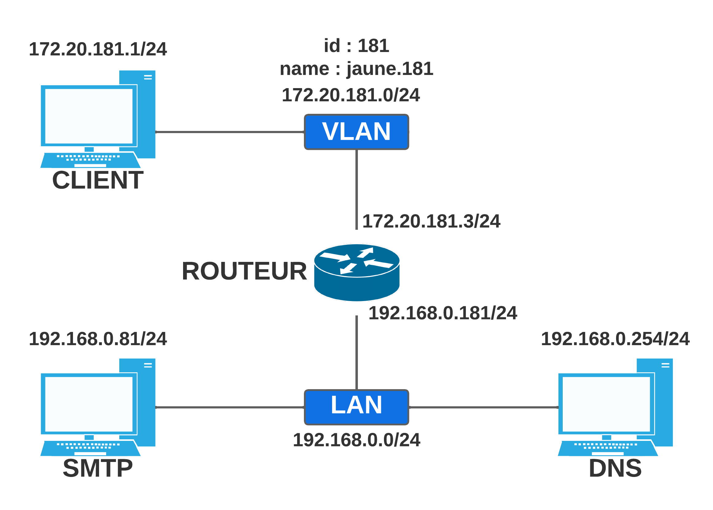
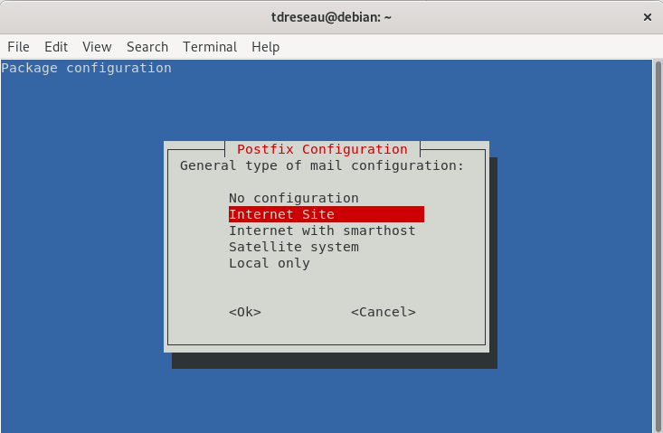
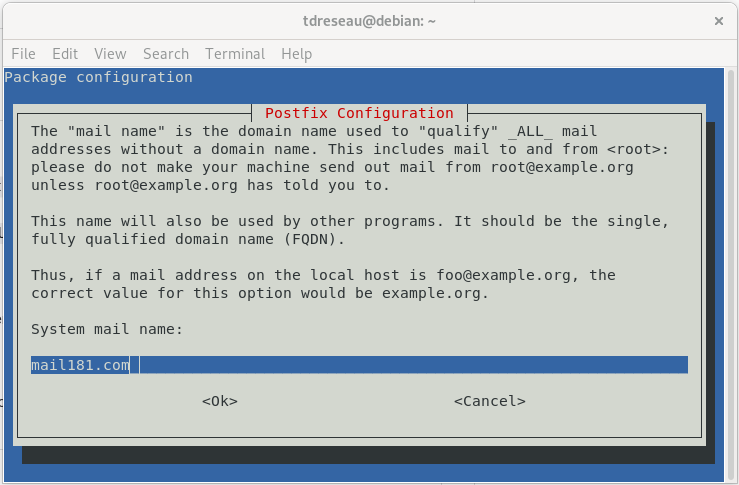
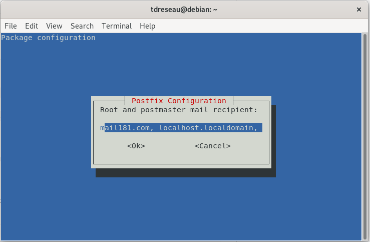
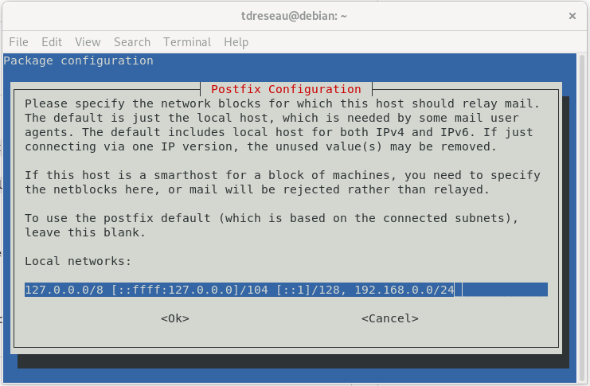
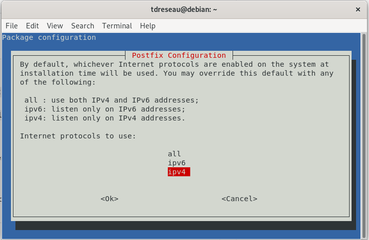
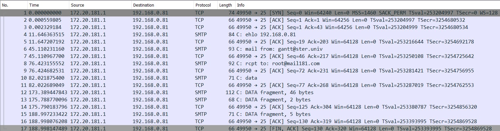

# Analyse session SMTP

* NOMS : Bernier Justine, Pasquet Clément
* GROUPE de TP : 1-2
* X : 181
* SECRET : arcturusepsilonscorpii
* IP_CLIENT : 172.20.181.1
* IP_DHCP : 172.20.181.2

## Étape Zéro : Recommencer la partie 1



Pour ce faire ce tp, nous avons commencé par configurer trois machines, SMTP, ROUTEUR et CLIENT.

Le client et le routeur étant sur le même VLAN, il faut mettre en place ce VLAN.

De même, ils existent différentes configurations à mettre en place pour toutes les machines, et cela, dans le but de mettre en place le réseau pour pouvoir faire le SMTP.

C'est pour cela que vous devez **refaire les manipulations du `rapport1.md`**.

Ici, nous ne préoccuperons uniquement de la mise en place d'un serveur avec le *Simple Mail Transfer Protocol*.


## Première étape pour configurer le SMTP
Dans le fichier resolv.conf faites la commande suivante :
```bash
nano /etc/resolv.conf
```

Et ensuite modifiez la ligne *nameserver* pour qu'elle ressemble à ça :

```
nameserver 192.168.0.254
```

Pour tester si cela a fonctionné, il faut tester sur la machine SMTP :

```bash
host smtp181.mail181.com
```

Qui est censé renvoyer :

> smtp181.mail181.com is an alias for machine181.mail181.com \
> machine181.mail181.com has address 192.168.0.81 


Ensuite, il faut installer les paquets nécessaires : 
## Installation du paquet Postfix
Le protocole SMTP (Simple Mail Transfert Protocol) est un protocole d'envoi de mail. Le serveur SMTP que nous mettrons en oeuvre ici est Postfix.

Réalisez ces commandes pour installer postfix.

Les deux premières permettent d'installer les paquets nécessaires et la 3ème permet de configurer le serveur de mail.

```shell
apt-get update --allow-releaseinfo-change
apt install postfix mailutils
dpkg-reconfigure postfix
```
## Configurez postfix

Lors de l'exécution de `dpkg-reconfigure postfix`, plusieurs fenêtres vont s'afficher. 

Une partie de ces pages auront besoin de configuration :

- Configuration type du serveur de messagerie : `Internet Site`

- Nom de courrier : `mail181.com`

- liste des domaines : `mail181.com localhost.localdomain, localhost`

- Réseaux internes : modifier pour ajouter `192.168.0.0/24` (n'oubliez pas les virgules)

- Protocoles internet à utiliser : `ipv4`


Laissez les autres options à leurs valeurs par défaut.

## Envoyez mail - Côté machine Client
Pour tester si nous pouvons envoyer un mail, il faut se connecter au port correspondant de l'adresse ip de notre SMTP avec la commande :
```shell
nc 192.168.0.81 smtp
```
Ici, nous nous connectons à notre SMTP ( `192.168.0.81` ) avec le protocole SMTP.

Cela donne :
```
220 localhost ESMTP Postfix (Debian/GNU)
```
Puis ensuite il faut se connecter à l'adresse ip du serveur, qui est toujours 192.168.0.81 :

**(ne pas copier les lignes qui commencent par 250)**
```
ehlo 192.168.0.81
250-localhost
250-PIPELINING
250-SIZE 10240000
250-VRFY
250-ETRN
250-STARTTLS
250-ENHANCEDSTATUSCODES
250-8BITMIME
250-DSN
250-SMTPUTF8
250 CHUNKING
```
Puis nous devons choisir à partir de quel email nous envoyons notre mail, à noter, ici, nous pouvons mettre ce que l'on souhaite comme email :
```
mail from: darth@starwars.univ
250 2.1.0 Ok
```
Puis il faut **choisir à quel adresse envoyer l'email**, attention, si l'email mis est incorrect, le mail ne sera pas envoyé.

Ici, nous envoyons notre mail à `root@mail181.com`.
> root correspondant à un ***nom d'utilisateur*** de SMTP. \
> mail181.com correspondant au ***nom de courrier*** de SMTP.

Ici, nous envoyons le mail directement au root.

Ainsi nous faisons :

```
rcpt to: root@mail181.com
250 2.1.5 Ok
```
Puis nous écrivons "data" pour indiquer que nous voulons commencer à écrire notre mail :
```
data

354 End data with <CR><LF>.<CR><LF>
```
Puis finalement, nous pouvons commencer à *écrire notre mail* :

( quand vous souhaiterez finir votre mail, passez une ligne, écrivez un point `.` puis re-faites entrée 
)

Exemple ci-dessous :
```
PASQUET, BERNIER, arcturusepsilonscorpii, 181
.
250 2.0.0 Ok: queued as 1210F36E6C
```
Finalement, quand vous souhaitez partir, faire la commande `quit` :

```
quit
221 2.0.0 Bye
```
### Lire le mail reçu, ici pour la machine SMTP

(nous partons du principe que la mail a été envoyé au root)

Lorsque la machine destinataire a reçu le mail, vous devriez observez ce message sur le terminale : `You have new mail in /var/mail/root`

Pour lire le mail, il faut faire la commande suivante :
```bash
nano /var/mail/root
```
Ici, nous pouvons voir tous les mails qui ont déjà été envoyé à l'utilisateur "root" de la machine SMTP.

Attention, le fichier contient tous les mails déjà reçus, alors n'hésitez pas à scroller pour trouver votre mail.

## Analyse capture de trames - de Client lorsqu'il envoie un mail a la machine SMTP



Voici la capture de trame de client quand il a envoyé un mail à SMTP.

Nous pouvons voir que le 1ère trame TCP qui est grise marque le début de la communication. 

La 2ème trame grise TCP marque elle la fin de la communication.

Ensuite, si nous regardons bien, nous pouvons détecter la présence de 7 paquets SMTP.

Étrangement, pour envoyer un mail avec `nc 192.168.0.81`, il faut effectuer 7 commandes, allant de `nc 192.168.0.81` à la commande `quit` pour partir.

Ainsi, à chaque étape de l'envoi de mail, le client envoie un paquet SMTP précédé d'au minimum un paquet TCP, contenant les informations.

Il est a noté que, contrairement à nos camarades, nous n'avons pas reçu de paquets de la part du serveur SMTP.

